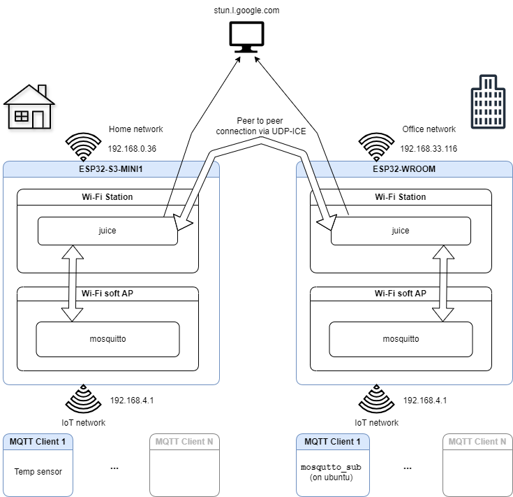

# Serverless MQTT

MQTT served by (two) light-weight brokers running on ESP chips.

## Demo project

Presented on Espressif Community Meeting (Oct 2024)

* Leverages MQTT connectivity between private networks without cloud premisses.
* Creates two local MQTT servers (on ESP32x's) which are being synchronized over peer to peer connection (established via ICE protocol, by libjuice).
* Demonstrates use of these public projects on ESP-IDF
  - mosquitto (public mqtt broker)
  - libjuice (simplified UDP ICE agent)

* Diagram

## Links

* Eclipse Mosquitto (open source MQTT broker): https://mosquitto.org/
* libjuice (UDP Interactive Connectivity Establishment): https://github.com/paullouisageneau/libjuice
* IDF mosquitto port
  - Last release: https://github.com/espressif/esp-protocols/releases/tag/mosq-v2.0.28_0
  - https://components.espressif.com/components/espressif/mosquitto
* ESP-ICE (WIP port of libjuice): https://github.com/david-cermak/esp-ice
